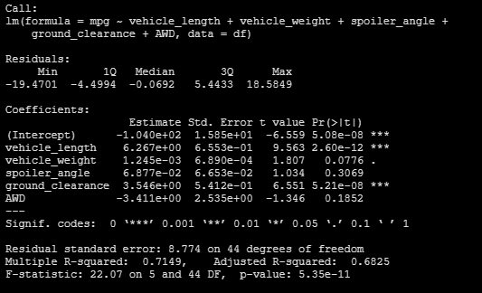
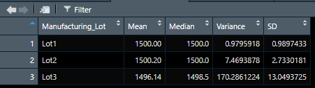
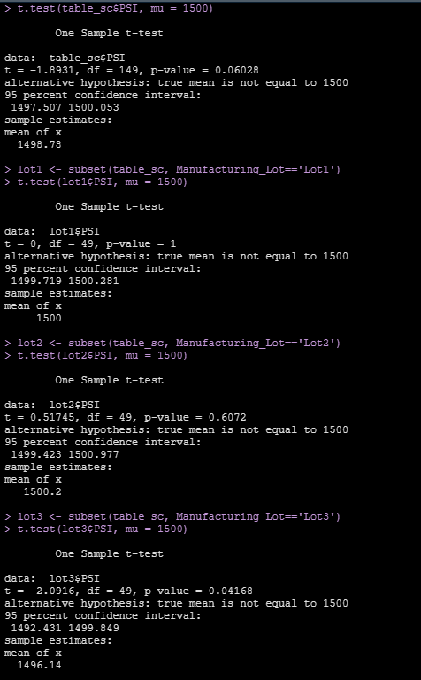

# MechaCar_Statistical_Analysis
Statistical Analysis on vehicle prototype.
    

## Resources
- Rstudio v1.3.1093
- VSCode v1.51.1

## Summary
## Linear Regression to Predict MPG
- When Analyszing the statistical (Pr - Probability) data for the variables that would play a vital role in Predicting mpg for mechacar.
- It is observed that Vehicle_length and ground clearance (As well as the intercept) are statistically unlikely to provide random amounts of variance to the dataset. This is justified as the Pr(>|t|) which represent the probability that each coefficient contributes a random variance to the linear model is either negligible or near 0. Thus considering Vehicle_length and ground_clearance are important factors to predict mpg for  MechaCar.
- Since there are statistically significant factors (Vehicle_Length and ground_clearance) that affect the fuel consumption (mpg), also seen with the p-value lower/ smaller than assumed significant level of 0.05 a confidence level of 95%, we can safely reject the null hypothesis and the slope is not 0.
- To quantify how well our linear model can predict the future, we calculate r-squared (r2) value also known as coefficient of determination, we did observe the r2 = 0.72, this quantifies the model as a good predictor for fuel consumption. In other words, 72% of the models predictions will be correct or the likelihood that future data points will fit the linear model.

    

## Summary Statistics on Suspension Coils
### Total Summary

- The total summary for entire production, we can infer that there is almost a perfect symmetrical or normal distribution. where mean and median are almost the same.
- The variance observed is **62.29psi** which is within design specification requirement. **The design spec variance should not exceed 100psi**.

    

### Lot Summary

- Lot 1 and Lot2 - mean occurrence and median occurrences are spot on, a variance within the design spec and low standard deviation. Lot 1 production being the better lot.
- Conclusion - Lot 1 and Lot 2 meet the design specification.
- Lot 3 - Variance observed does not meet or does not comply with the required design spec of 100psi. variance recorded is 170.2 psi, which is 70 psi more than the allowed spec. 
conclusion - lot 3 standard deviation is higher than other production lots which indicates that the lots production are spread over a large range away from the mean. Moreover, the allowed variance for suspension coil psi has exceed design standards.
    

## T-Tests on Suspension Coils

- Ho - Null Hypothesis assumes there is no statistical difference between means of sample datasets and presumed population mean.
- Ha - Alternate Hypothesis assumes there is a statistical difference.

- population sample dataset mean is 1499psi. The p-value for the entire population is 0.06%, since the p-value is higher than the significance level of 0.05%, we can say that there is not enough evidence to reject the null hypothesis, meaning that the two means are statistically similar.
- Similarly in Lot 1 - p Value is at 1%, Lot 2- p value is at 0.6% much higher than that of our assumed significance level of 0.05%, we do not have sufficient evidence to reject the null hypothesis that the Lot1 & Lot2 are **not** statistically similar.
- We would reject Lot3 as the p value is at 0.04%, which is lower than our significance level of 0.05%, which means Lot3 is statistically different from the population mean.

    

## Study Design: MechaCar vs Competition

- In today's world, consumers would prioritize the metrics cost_price, engine displacement and fuel_efficiency as top priority. considering the consumer level is a family with kids and an analysis of Mechacar vs its competition in these metrics will prove important to test.

- Ho Null hypothesis - Assuming that there is no difference between MechaCar and its competition where no difference is seen with all our metrics.
The alternative hypothesis is that there is a difference in regards to engine displacement vs fuel_efficiency and how this affects cost_price.

- Multiple Linear regression will be a top choice to see Pearson's correlations (r) as well as how much variance between our metrics would provide linearity between engine displacement/size vs fuel_efficiency vs cost_price, and assuming that there is no difference we would expect to see a flat line with slope 0 if not the latter.This will clearly give us a clear picture of some of the parameters that influence an introductory model into an existing market ,and carefully predict our parameters that would make a difference to be competitive.

- Data needed to run the statistical tests are very much available already, but a large population dataset of recorded fuel_efficiency, pricing and engine displacement specs (features and complexity) with values that are closer to the mean to provide a symmetrical data.
